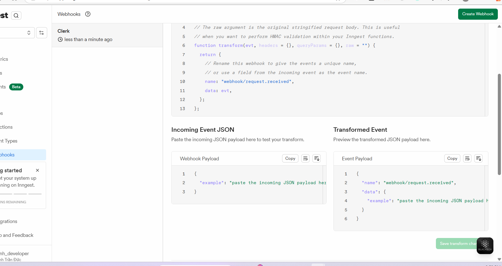

sau khi viết 2 file env và docker compose => chạy `docker compose up`

docs drizzle => getstarted => postgres

# inngest setup

vào clerk => dashboard => webhook => add endoint => inngest (ở cái dropdown)

docs inngest `https://www.inngest.com/docs/getting-started/nextjs-quick-start`

vào `https://app.inngest.com/env/production/manage/webhooks` => vào cái `all Envi`ở chỗ cái `production` => crate env `dev` => chọn env dev đó => webhook => create => có 1 cái đường link => copy nó

quay về cái clerk dashboard => add your own.... => paste nó vào => connect => kéo cuống => create => subscribe events => chọn `organization`,`orMembership.create,upodate`,`user`

vào docs `https://clerk.com/docs/webhooks/overview` => copy đoạn code `user.created`=> paste vào phần

của inggest ( paste vào phần Incoming Event JSON )

=> sửa cái name => `name: "clerk/request.received",`

```ts
// transform accepts the incoming JSON payload from your
// webhook and must return an object that is in the Inngest event format.
//
// The raw argument is the original stringified request body. This is useful
// when you want to perform HMAC validation within your Inngest functions.
// transform accepts the incoming JSON payload from your
// webhook and must return an object that is in the Inngest event format.
//
// The raw argument is the original stringified request body. This is useful
// when you want to perform HMAC validation within your Inngest functions.
function transform(evt, headers = {}, queryParams = {}, raw = "") {
  return {
    // Rename this webhook to give the events a unique name,
    // or use a field from the incoming event as the event name.
    name: `clerk/${
      evt.type || eve.name || eve.even_type || "webhook.received"
    }`,
    data: { data: evt.data || evt, headers, raw },
  };
}
```

=> save

chạy 2 câu lệnh sau

```bash
 npm install inngest
 npm i -D inngest-cli@latest 
```